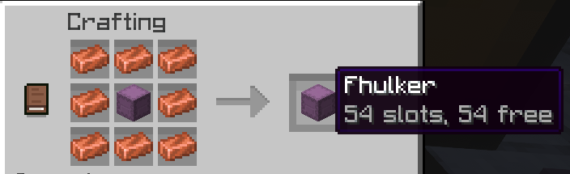

# Fhulkers

A Paper plugin that adds the **Fhulker**: a shulker box with 54 slots (a double chest's worth) instead of 27. Regular shulker boxes are left completely vanilla.

## Crafting

Surround any shulker box with 8 copper ingots:



The result is that same box upgraded into a Fhulker. It keeps its color, custom name, and any items already inside. The recipe appears in the recipe book once a player first holds a shulker box. It works in the crafting grid either way.

Notes:

- A box that is already a Fhulker can't be used in the recipe, so copper isn't wasted.
- Crafters (the block) can't craft Fhulkers.

## Using a Fhulker

- **Right-click** a placed Fhulker to open the 54-slot inventory. Sneak-right-click with an item in either hand to place that item against the box instead, as with vanilla.
- The item shows `54 slots, N free` in its lore.
- Fhulkers can be broken, picked up, and placed again with every item intact, including by explosions, pistons, and flowing liquids. In Creative mode the box drops only if it has contents, as in vanilla.
- If several players have the same Fhulker open, they all see one shared inventory, so items can't be duplicated.
- Shulker boxes can't be placed inside a Fhulker (vanilla rule).
- Dispensers won't place a Fhulker, because that would lose its extra slots.
- Hoppers and hopper minecarts can't move items in or out of a Fhulker while a player has it open.
- Items in the first 27 slots work with hoppers and comparators like a normal shulker box. Slots 28-54 are only reachable through the GUI.

## Installation

Requires Paper (or a Paper fork such as Purpur) 26.2 and Java 25.

Drop the plugin jar into your server's `plugins/` folder and restart. There is no configuration file.

## Development

### Building

```
mvn package
```

The jar is written to `target/Fhulkers-1.0.0-SNAPSHOT.jar`. Pass `-Drevision=1.2.3` to build a specific version.

### Releases

Releases are built by GitHub Actions and attached to the repo's Releases page. Versions follow [semantic versioning](https://semver.org/).

- **Automatic:** run the *Release* workflow from the Actions tab (on `master`) and choose `patch`, `minor` or `major`. It increments the latest `vX.Y.Z` tag, builds the jar, then tags and publishes the release. The first release is `1.0.0`.
- **Manual tag:** pushing a tag like `v1.2.0` releases exactly that version.

Each release is also uploaded to [Hangar](https://hangar.papermc.io/) when the `HANGAR_API_KEY` repository secret is set (skipped otherwise). The Hangar project name and channel default to `Fhulkers` and `Release`; override them with the `HANGAR_PROJECT` and `HANGAR_CHANNEL` repository variables. The supported Paper versions are listed in the workflow (`PAPER_VERSIONS`).

The same step replaces the Hangar project page with the top of this README (everything above "Development"), with images pointing at the release tag on GitHub, so edit the page here rather than in Hangar's editor.

### Test builds

Every push to a branch other than `master` runs the *Snapshot* workflow, which builds a `-SNAPSHOT` jar (the next patch version, e.g. `1.0.1-SNAPSHOT`). Nothing is tagged or released: open the workflow run in the Actions tab and download the jar from **Artifacts**. Snapshot artifacts are kept for 14 days.

### How it works

A Fhulker is an ordinary shulker box item or block with a `fhulkers:fhulker` marker in its persistent data. Slots 1-27 use the vanilla inventory (so hoppers, comparators, the tooltip, and dyeing keep working). Slots 28-54 are serialized next to the marker, and both move between the item and the block when it is placed or broken.

## License

MIT. See [LICENSE](LICENSE).
